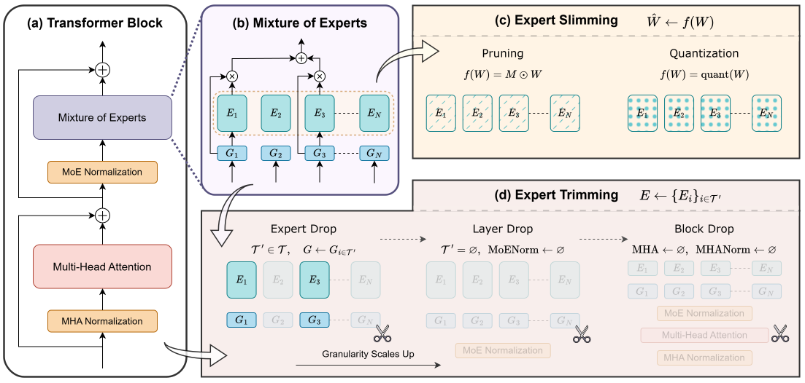

# Demystifying the Compression of Mixture-of-Experts Through a Unified Framework

**[Shwai He](https://shwai-he.github.io/)\*, [Daize Dong](https://daizedong.github.io/)\*, [Liang Ding](https://liamding.cc/), [Ang Li](https://www.ang-li.com/)**

**This is the official implementation of the paper [Demystifying the Compression of Mixture-of-Experts Through a Unified Framework](https://arxiv.org/abs/2406.02500).** We provide a comprehensive framework for compressing Mixture-of-Experts models. Pipeline for pruning and Expert Trimming is based on the [LLaMA-Factory](https://github.com/hiyouga/LLaMA-Factory). The quantization is implemented based on the [AutoAWQ](https://github.com/casper-hansen/AutoAWQ) and [AutoGPTQ](https://github.com/AutoGPTQ/AutoGPTQ).

## Introduction

The Mixture of Experts (MoE) approach dynamically selects and activates only a subset of experts, significantly reducing computational costs while maintaining high performance. However, MoE introduces potential redundancy (e.g., parameters) and extra costs (e.g., communication overhead). Since the compression of MoE remains under-explored, we address this gap with a cutting-edge unified framework that seamlessly integrates mainstream compression methods and helps systematically understand MoE compression. This framework approaches compression from two perspectives: Expert Slimming, which compresses individual experts, and Expert Trimming, which removes structured modules. Within this framework, we explore the optimization space unexplored by existing methods
and introduce aggressive Expert Trimming techniques, such as Layer Drop and Block Drop, to eliminate redundancy on a larger scale. Based on these insights, we present a comprehensive recipe to guide practitioners in effectively compressing MoE.




## Installation

#### Environment

```bash
conda create -n moe-compression python=3.10
conda activate moe-compression

git clone git@github.com:DaizeDong/Unified-MoE-Compression.git

cd ./Unified-MoE-Compression
pip install -e .
pip install flash-attn --no-build-isolation

cd ./AutoAWQ
pip install -e .

cd ../AutoGPTQ
pip install -vvv --no-build-isolation -e .
```

#### Prepare Models

Download the [Mixtral-8x7B](https://huggingface.co/mistralai/Mixtral-8x7B-v0.1) and [DeepSeek-MoE-16B](https://huggingface.co/deepseek-ai/deepseek-moe-16b-base) model from HuggingFace, and **delete** the following lines in the `config.json` of DeepSeek-MoE-16B.

```json
"auto_map": {
  "AutoConfig": "configuration_deepseek.DeepseekConfig",
  "AutoModel": "modeling_deepseek.DeepseekModel",
  "AutoModelForCausalLM": "modeling_deepseek.DeepseekForCausalLM"
},
```

## Running Compression

### Expert Slimming

#### Pruning

```bash
bash scripts/compression/pruning/mixtral_prune.sh
bash scripts/compression/pruning/deepseek_prune.sh
bash scripts/compression/pruning/deepseek_prune_noshared.sh
```

#### Quantization
Please refer to [AutoGPTQ](https://github.com/AutoGPTQ/AutoGPTQ) and [AutoAWQ](https://github.com/casper-hansen/AutoAWQ). Ensure you carefully install the packages that correspond to your CUDA version. Additionally, for AWQ, you need to install the AWQ_Kernels:
```
cd AutoAWQ/AutoAWQ_kernels
pip install -e .
```
For quantization, use the following scripts:
```bash
bash scripts/compression/quantization/awq.sh
bash scripts/compression/quantization/gptq.sh
```

### Expert Trimming

#### Expert Drop

For normal `bfloat16` or `float32` models, run:

```bash
bash scripts/compression/expert_drop/mixtral_expert_drop.sh
bash scripts/compression/expert_drop/deepseek_expert_drop.sh
```

For quantized models, run:

```bash
bash scripts/compression/expert_drop/mixtral_expert_drop_quantized.sh
bash scripts/compression/expert_drop/deepseek_expert_drop_quantized.sh
```

#### Layer Drop

```bash
bash scripts/compression/layer_drop/mixtral_layer_drop.sh
bash scripts/compression/layer_drop/deepseek_layer_drop.sh
bash scripts/compression/layer_drop/mixtral_layer_drop_quantized.sh
bash scripts/compression/layer_drop/deepseek_layer_drop_quantized.sh
```

#### Block Drop

```bash
bash scripts/compression/block_drop/mixtral_block_drop.sh
bash scripts/compression/block_drop/deepseek_block_drop.sh
bash scripts/compression/block_drop/mixtral_block_drop_quantized.sh
bash scripts/compression/block_drop/deepseek_block_drop_quantized.sh
```

## Running Evaluation

#### FLOPs & Speedup

```bash
bash scripts/evaluation/speedup/measure_flops.sh
bash scripts/evaluation/speedup/measure_speed.sh
```

#### Loss & PPL

```bash
bash scripts/evaluate/loss/mixtral_evaluate.sh
bash scripts/evaluate/loss/deepseek_evaluate.sh
```

#### Benchmarks

```bash
bash scripts/evaluate/benchmark/......
```

TODO: Add lm-evaluation-harness here.

Please refer to [EleutherAI/lm-evaluation-harness](https://github.com/EleutherAI/lm-evaluation-harness).

Remember to use the modeling files in `src/llmtuner/model` to load the Mixtral and DeepSeek models.

## Citation

```latex
@article{he2024demystifying,
  title={Demystifying the Compression of Mixture-of-Experts Through a Unified Framework},
  author={He, Shwai and Dong, Daize and Ding, Liang and Li, Ang},
  journal={arXiv preprint arXiv:2406.02500},
  year={2024}
}
```

## Contact Us

If you have any questions, please contact:

- Shwai He: shwaihe@umd.edu

- Daize Dong: dzdong2019@gmail.com
